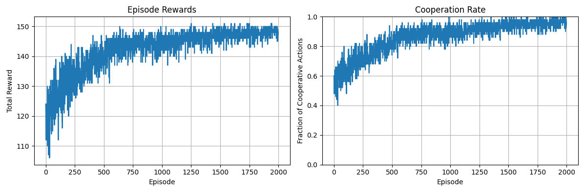

# Prisoner's Dilemma Reinforcement

A PyTorch implementation of the REINFORCE algorithm for training neural network agents to play the iterated Prisoner's Dilemma against various opponent strategies.

<strong>⚠️ WARNING: This repo was mostly vide coded with claude ⚠️</strong>

## Overview

This project explores how artificial agents can learn cooperative behaviors. The agent uses a neural network policy trained with policy gradients to adapt its strategy based on game history and opponent behavior.

## Features

- **Multiple Opponent Strategies**: Random, Tit-for-Tat, Always Cooperate, Always Defect
- **Configurable Environment**: Adjustable episode length and history window
- **Neural Network Policy**: Fully connected network with customizable architecture
- **REINFORCE Training**: Policy gradient algorithm with discount factor
- **Real-time Visualization**: Training progress plots for rewards and cooperation rates
- **Performance Evaluation**: Statistical analysis of trained policies

## Environment

The Prisoner's Dilemma uses the standard payoff matrix:

- Both Cooperate: (3, 3)
- Player Cooperates, Opponent Defects: (0, 5)
- Player Defects, Opponent Cooperates: (5, 0)
- Both Defect: (1, 1)

**Actions**: 0 = Cooperate, 1 = Defect  
**Observations**: History of last N moves for both players

# Training Results

- Against tit for tat:
  
